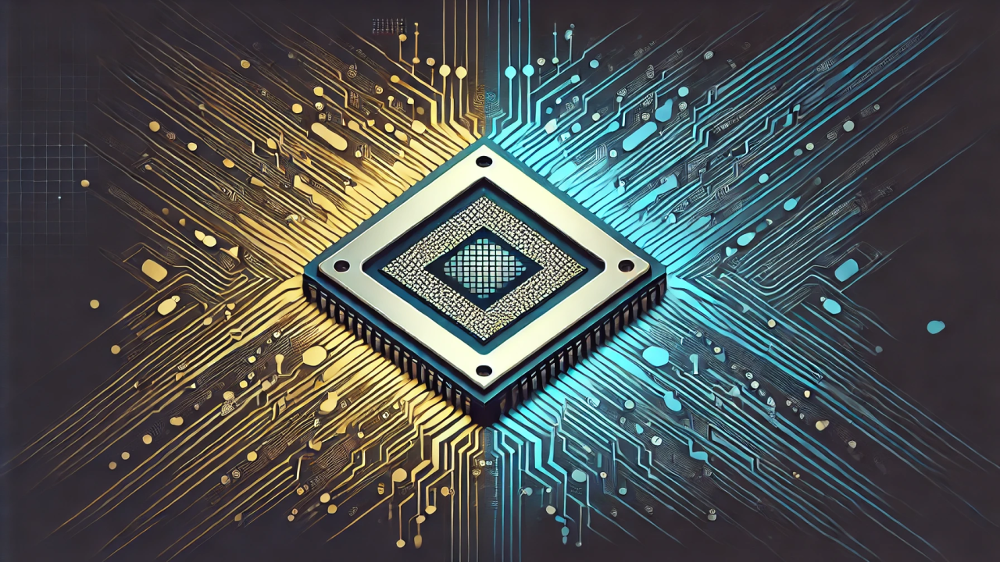

# Dual Expertise: Leveraging Intel's Use of Both TSMC and Intel Nodes in IC Layout Design

Originally published on [LinkedIn](https://www.linkedin.com/pulse/dual-expertise-leveraging-intels-use-both-tsmc-intel-nodes-hargus-bd1ec/)

---

*Published: January 08, 2025*  
*By Tamra Hargus*

---

In the rapidly evolving world of semiconductor design, flexibility and broad expertise are more valuable than ever. My career at Intel progressed through several specialized roles, starting as an Analog Mask Designer, then moving to SRAM, and ultimately leading to my role as a SoC Layout Designer. This journey, enhanced by various team loaning arrangements, provided me with a unique opportunity to work not only with Intel’s advanced process nodes but also with TSMC’s, enhancing my versatility across different technologies.

---

## Embracing Challenges Across Different Nodes

One of the milestones in my career was my initial exposure to cut layers within a TSMC node. This challenge, which occurred some time ago, coincided with my transition from Intel’s internal layout tool to Cadence. The shift required adapting to different node’s technical requirements and was a significant adjustment in my career.

Intel and TSMC provide substantial training and support, which was instrumental in overcoming these early challenges. The ability to work interchangeably on projects involving different nodes has been crucial in staying versatile in this field. It’s akin to keeping up with two languages fluently, where muscle memory plays a significant role in retaining skills, despite the months-long duration of projects.

---

## The Value of Dual Node Experience

The semiconductor industry’s landscape is shifting, with Intel betting big on its foundry business, which might change how process nodes are utilized moving forward. This makes the experience with both Intel and TSMC nodes not just an asset but a necessity for mask designers who need to be adaptable and quick to learn.

Companies looking to hire Intel mask designers are in for a treat. They will find individuals who are not just flexible but also quick to adapt to different process nodes and tools. This adaptability is essential as it speaks to a designer’s ability to navigate through the complexities of modern IC design, ensuring they can handle the demands of innovative semiconductor development.

---

## Final Thoughts

As the industry continues to evolve, the ability to adapt and learn will be the cornerstones of successful careers in semiconductor design. My journey through the nodes of Intel and TSMC has taught me that while the tools and processes may differ, the underlying principles of dedication, adaptability, and continuous learning remain the same.

